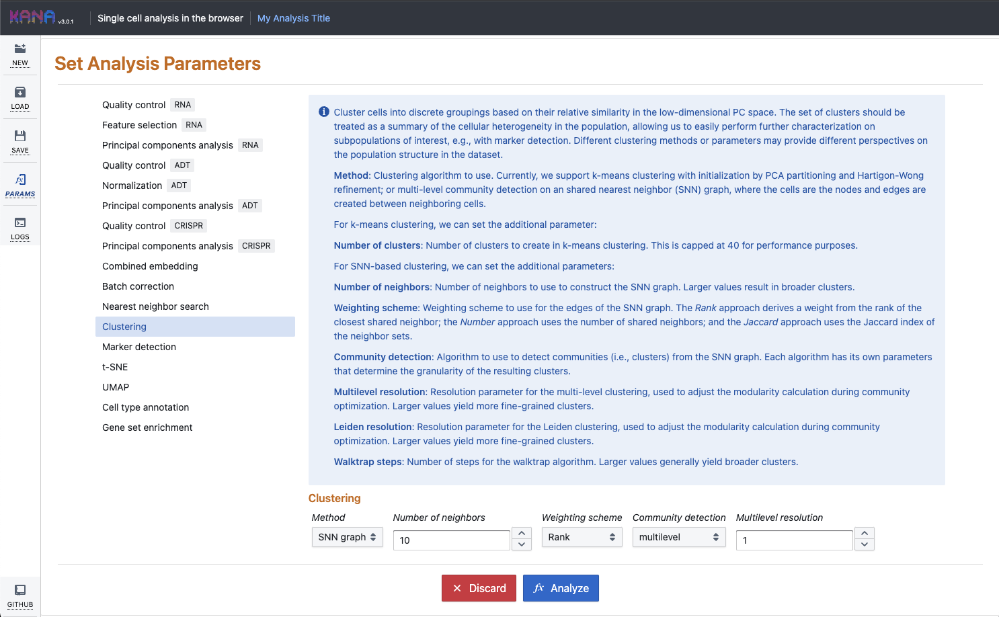

# Summary

We present kana, a web application for interactive single-cell 'omics data analysis in the browser.
Like, literally, in the browser:
kana leverages web technologies such as WebAssembly to efficiently perform the relevant computations on the user's machine,
avoiding the need to provision and maintain a backend service. 
The application provides a streamlined one-click workflow for the main steps in a typical single-cell analysis, 
starting from a count matrix and finishing with marker detection.
Results are presented in an intuitive web interface for further exploration and iterative analysis. 

# Statement of need

Single-cell 'omics is routinely used to identify cell subpopulations with distinct molecular phenotypes in heterogeneous biological samples [@stegle2015computational].
For example, in single cell RNA sequencing (scRNA-seq), cells are clustered based on their transcriptional profiles and each cluster is characterized based on differential expression of marker genes.
Changes in expression or cellular abundance for each cluster can then provide some insight into the biological processes associated with the corresponding cell type or state.
This analysis is often exploratory in nature as the properties of an interesting cell subpopulation are difficult to define _a priori_.
As a result, each analysis involves several iterations of computation, visualization and interpretation by biologists who may not be familiar with programming frameworks for bioinformatics.

Web applications offer an ideal environment for single-cell analyses, providing a user-friendly interface to the analysis workflow without any installation of additional software (other than a browser).
Most existing web applications for single-cell analysis [@megill2021cellxgene;@cirrocumulus;@shiny] use a traditional server-based architecture,
where data is sent to a backend server to compute results that are returned to the client (i.e., the user's machine) for visualization.
This obviously requires the deployment of a backend server, which has non-negligible cost when scaled to a large number of users.
It also requires data transfer from the client to the server, which introduces latency as well as invoking concerns over data ownership and privacy.

An alternative paradigm is to perform all the compute on the client device.
This "client-side compute" circumvents all of the aforementioned issues with a backend server as data remains local to the user's machine and is analyzed wholly within the browser.
Some existing web applications have employed this approach for bioinformatics data analysis [@gomez2013biojs;@schmid2015browsergenome;@fan2017ubit2], but these represent a minority in the application ecosystem.
This is not surprising given the paucity of efficient, browser-compatible implementations of various algorithms required for such analyses.
However, new web technologies such as WebAssembly [@haas2017bringing] have greatly enhanced browsers' capabilities for intensive computation.
If we could generate a WebAssembly (Wasm) binary containing single-cell analysis functionality, we could feasibly repurpose the browser as a self-contained interactive data analysis tool for single-cell 'omics.

To this end, we present kana, a web application for analyzing single-cell `omics data inside the browser (https://www.kanaverse.org/kana).
kana provides a streamlined one-click workflow for the main steps in a typical single-cell analysis [@amezquita2020orchestrating],
starting from a count matrix (or multiple such matrices, for datasets with multiple modalities and/or samples) and finishing with marker detection.
Users can interactively explore the low-dimensional embeddings, clusterings and marker genes in an intuitive graphical interface that encourages iterative re-analysis.
Once finished, users can save their analysis and results for later examination or sharing with collaborators.
By using technologies like WebAssembly and web workers, we achieve high-performance client-side compute for datasets containing hundreds of thousands of cells.

# Usage

Given a single-cell dataset - typically for gene expression, but possibly with protein and/or CRISPR counts - kana executes a routine analysis based on @oscabook.
Users can supply data in several formats, such as Matrix Market files produced by the Cellranger pipeline;
HDF5 files, using either the 10X HDF5 feature barcode matrix format or as H5AD files; 
SummarizedExperiment or SingleCellExperiment objects [@amezquita2020orchestrating] saved to RDS files;
or datasets from public repositories like Bioconductor's ExperimentHub [@morgan2019experimenthub].
The entire analysis can then be executed with a single click, though users can easily customize key parameters if desired (\autoref{screenshot:analysis}).

Once each step of the analysis is complete, kana visualizes its results in a multi-panel layout (\autoref{screenshot:results}).
One panel contains a scatter plot for the low-dimensional embeddings, where each cell is a point that is colored by cluster identity or gene expression.
Another panel contains a table of marker statistics for a selected cluster, where potential marker genes are ranked and filtered according to the magnitude of upregulation over other clusters.
This interface allows scientists to explore the heterogeneity in the cell population and to find the biological processes that are most active within each cluster.
We also provide a gallery to visualize miscellaneous details such as the distribution of QC metrics.

Once the analysis is complete, users can export the analysis configuration and results for later inspection.
The exported results can be quickly reloaded in a new browser session, allowing users or their collaborators to explore existing results without repeating the computation.
Indeed, kana's "explore-only" mode can be used more generally for single-cell analysis results in other formats, e.g., to load RDS or H5AD files containing pre-computed clusterings and low-dimensional embeddings.
Similarly, the exported configuration can be used to restore the analysis session for further parameter tuning and iteration.

# Implementation details

We convert the browser into a compute engine by compiling scientific libraries for bioinformatics data analysis to Wasm - see the biowasm project [@biowasm] for previous efforts in this direction.
For kana, we created C++ implementations of the data representations or algorithms required for each analysis step:

- tatami [@tatami] provides an abstract interface to different matrix classes, based on ideas in the beachmat [@lun2018beachmat] and DelayedArray [@delayedarray] packages.
- CppWeightedLowess [@cppweightedlowess] contains a C++ port of the weightedLowess function from the limma package [@ritchie2015limma], itself derived from R's LOWESS implementation [@cleveland1979robust].
- CppIrlba [@cppirlba] contains a C++ implementation of the IRLBA algorithm [@baglama2005augmented], based on the C code in the irlba R package [@irlba].
- CppKmeans [@cppkmeans] implements the several algorithms for k-means clustering [@hartiganwong;@lloyd;@vassilvitskii2006kmeanspp@su2007search], based on R's Fortran code.
- knncolle [@knncolle] wraps several nearest neighbor detection algorithms [@yianilos1993data;@annoy] in a consistent interface, using the same design as the BiocNeighbors package [@biocneighbors].
- libscran [@libscran] implements high-level methods for scRNA-seq data analysis based on code from the scran, scuttle and scater packages [@lun2016step;@lun2017scater].
- qdtsne [@qdtsne] contains a C++ implementation of the Barnes-Hut t-SNE algorithm [@maaten2014accelerating], refactored and optimized from code in the Rtsne package [@rtsne].
- umappp [@umappp] contains a C++ implementation of the UMAP algorithm [@mcinnes2018umap], derived from code in the uwot R package [@uwot].
- SinglePP [@singlepp] contains a C++ implementation of the SingleR algorithm for cell type annotation [@aran2019reference].
- CppMnnCorrect [@cppmnncorrect] implements the MNN method for batch correction [@haghverdi2018batch], loosely based on an existing method from the batchelor package [@batchelorbioc].
- rds2cpp [@rds2cpp] provides a RDS file parser/writer as a standalone C++ library.

We compiled these libraries to a Wasm binary using the Emscripten toolchain [@zakai2011emscripten], using PThreads to enable parallelization via web workers.
We then wrapped the binary in the scran.js library [@scran.js] to provide JavaScript bindings for use in web applications.
kana itself was developed using React with extensive use of WebGL for efficient plotting.
On a moderately sized scRNA-seq dataset containing over 170,000 cells [@zilionis2019single],
kana was able to finish the analysis in under 5 minutes and using less than 3 GB of RAM on a consumer laptop.

# Further comments

kana's key innovation lies in its use of modern web technologies to perform the analysis directly in the browser.
This eliminates the difficulties of software installation and makes the analysis accessible to a non-programming audience.
At the same time, we retain all the benefits of client-side operations, i.e., no dependence on a backend server, no latency from data transfer, no issues with data ownership, and (effectively) free compute.

Client-side compute has interesting scalability characteristics compared to a traditional backend approach.
Most obviously, we are constrained by the computational resources available on the client machine, which limits the size of any single dataset that can be analyzed by a particular client.
From another perspective, though, client-side compute is more scalable as it automatically distributes analyses of many datasets across any number of machines at no cost and with no configuration.
This is especially relevant for web applications like kana where the maintainers would otherwise be responsible for provisioning backend computing resources.

That said, how do we deal with large datasets?
Our C++ implementations mean that we are not limited to computation in the browser.
We can easily provide wrappers to the same underlying libraries in any client-side framework, e.g., as a command-line tool or as an extension to existing data science ecosystems [@scranchan].
Indeed, one could use the wrapped C++ libraries to run large analyses on a sufficiently provisioned backend, export the results in a kana-compatible file format, and then serve them to clients for use in kana's exploration mode.

# Acknowledgements

We thank Michael Lawrence, Hector Corrada Bravo and Adrian Waddell for their suggestions to improve this manuscript.

# References
